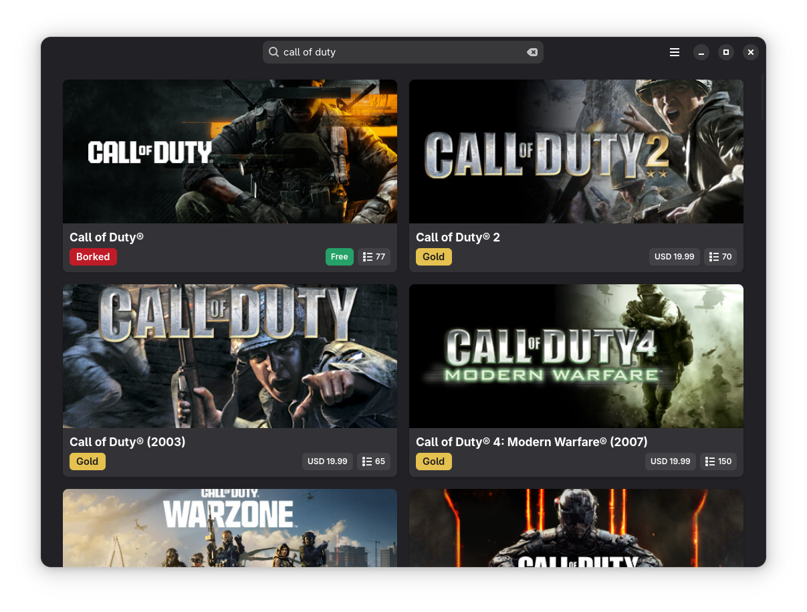

# Compat

Compat is a GTK 4 and libadwaita desktop app for searching Steam games and checking their ProtonDB compatibility from a native Linux interface.

## Features

- Search the Steam catalog.
- View ProtonDB compatibility tiers alongside store results.
- Open a detailed game sheet with release, pricing, platform, language, and requirements data.

## Development

This project uses Meson for building and packaging.

- Application ID: `io.github._6e6b.compat`
- Runtime stack: GTK 4, libadwaita, PyGObject
