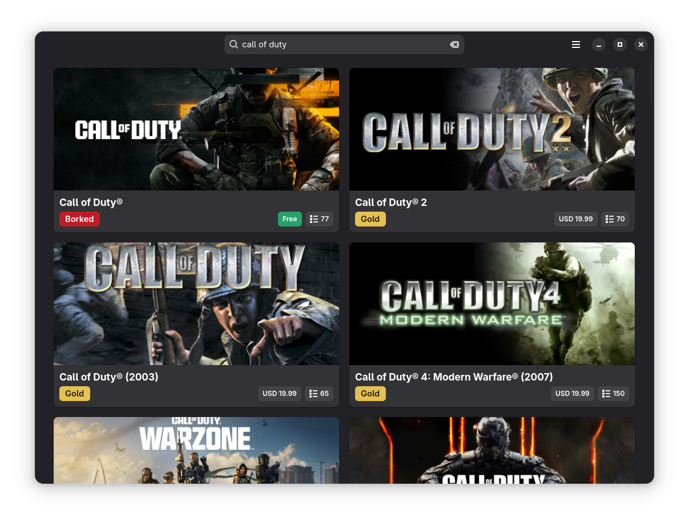

# Compat

Native GTK 4 / libadwaita app for searching Steam games and checking [ProtonDB](https://www.protondb.com/) compatibility on Linux.



## Features

- Search the Steam catalog from a native desktop UI
- ProtonDB compatibility tiers next to store results
- Detailed game sheet (release, pricing, platforms, languages, requirements)
- Recent searches and saved games
- Keyboard shortcuts and persistent window state

## Requirements

- Python 3 with PyGObject
- GTK 4 and libadwaita
- Meson ≥ 1.0 and Ninja
- `gettext`, `desktop-file-utils`, and AppStream tools (for install metadata)

On Fedora / similar:

```bash
sudo dnf install meson ninja-build gtk4-devel libadwaita-devel \
  python3-gobject gettext desktop-file-utils libappstream-glib
```

On Debian / Ubuntu:

```bash
sudo apt install meson ninja-build libgtk-4-dev libadwaita-1-dev \
  python3-gi python3-gi-cairo gir1.2-gtk-4.0 gir1.2-adw-1 \
  gettext desktop-file-utils appstream
```

## Build and run

```bash
meson setup builddir
meson compile -C builddir
meson test -C builddir
./builddir/src/compat
```

Or install into a local prefix:

```bash
meson setup builddir --prefix="$HOME/.local"
meson install -C builddir
compat
```

## Flatpak

Manifest: `io.github._6e6b.compat.json` (GNOME Platform 50).

```bash
flatpak-builder --user --install --force-clean build-flatpak io.github._6e6b.compat.json
flatpak run io.github._6e6b.compat
```

A manual GitHub Actions workflow can also produce a `.flatpak` artifact (`Actions` → `Flatpak` → `Run workflow`).

## Development

- Application ID: `io.github._6e6b.compat`
- Stack: GTK 4, libadwaita, PyGObject, Meson
- Tests: `python3 -m unittest discover -s tests`

## License

MIT — see [COPYING](COPYING).
